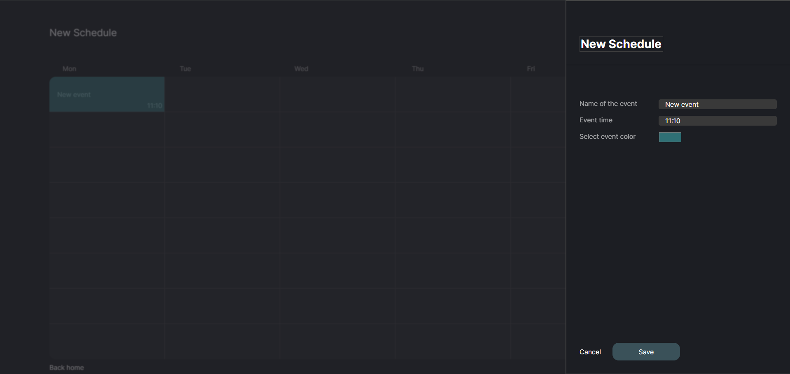

# EduPlanner - Web

## Screenshots

    
    
    
    

## Table of Contents

- [Introduction](#introduction)
- [Key Features](#key-features)
- [Usage](#usage)
- [Technologies used](#technologies-used)

## Introduction

EduPlanner - is a web application where you can create, edit and share schedules with your classmates or classmates.

## Key Features

- Manage your schedules.
- Use other users' schedules
- Quick access to recently visited schedules.
- User-friendly design.

## Usage
- Navigate to [main](https://eduplanner-iota.vercel.app/) page
- Register or log in to the application.
- Create a schedule.
- Сustomize your events.
- Open access to everyone who has the link if you want it.

## Will be in the future
- Selecting the number of days in the schedule.
- Adding or removing event numbering.
- Сustom fields in event settings.
- Language and theme changes
- Landing page.
- Change in the number of events per day.

## Technologies used
- *React* - The JavaScript library used to build the web app's user interface.
- *REST API* - Provides data and serves as the backend for the web app.
- *Scss* - Writing styles for elements.
- *TypeScript* - Provides static typing, improving security, code readability, and maintaining modern language capabilities.